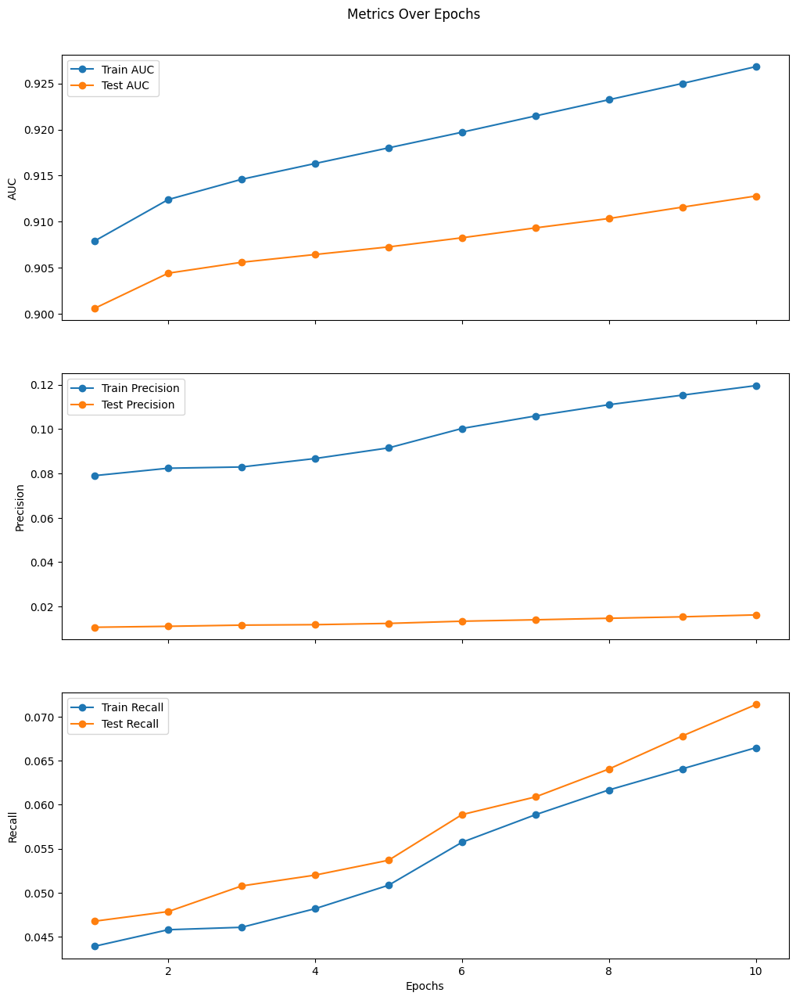

<!-- PROJECT LOGO -->
 

    
    

  <h3 align="center">Games Recommender System using LightFM on Steam Dataset</h3>

  

    Picture having a buddy who just gets you and suggests the ideal game for your adventures
     
    <a href="https://github.com/thehir0/steam-recsys/tree/main"><strong>Explore the docs »</strong></a>
     ·
    <a href="https://drive.google.com/file/d/1C3u76hoq-7fqbN1T6aOajf9SB4nmE7sR/view?usp=sharing"><strong>Check Project Blog on Medium »</strong></a>
     ·
    
     
  

  

<!-- TABLE OF CONTENTS -->

  
Table of Contents

  <ol>
    <li>
      <a href="#about-the-project">About The Project</a>
    </li>
    <li><a href="#steam-dataset">Steam dataset</a></li>
    <li>
        <a href="#model-architecture">Model architecture</a>
        <ul>
            <li><a href="#lightfm-package">LightFM package</a></li>
            <li><a href="#modelling-approach">Modelling approachn</a></li>
        </ul>
    </li>
    <li><a href="#results-metrics">Results (Metrics)</a></li>
    <li><a href="#contact">Contact</a></li>
    <li><a href="#license">License</a></li>
  </ol>

## About the project

In this project, we developed a Games Recommender System using the LightFM library on the Steam dataset. The recommendation system employs a hybrid approach, combining collaborative filtering and content-based filtering techniques to provide personalized game suggestions for both multiplayer gaming sessions and solo adventures on the Steam platform. By considering user interactions, game metadata, and individual preferences, our model aims to enhance the gaming experience by offering nuanced and tailored recommendations.

## Steam dataset

For this project/post, we’ll be using the Steam dataset, which contains 7,793,069 reviews, 2,567,538 users, and 32,135 games. In addition to the review text, the data also includes the users’ play hours in each review.

We’ll focus on the interactions between users and items as well as on metadata about games, such as publisher, release date, genres and tags.

## Model architecture

### LightFM package

LightFM is a Python implementation of a hybrid recommendation algorithms for both implicit and explicit feedbacks.

It is a hybrid content-collaborative model which represents users and items as linear combinations of their content features’ latent factors. The model learns **embeddings or latent representations of the users and items in such a way that it encodes user preferences over items**. These representations produce scores for every item for a given user; items scored highly are more likely to be interesting to the user.

The user and item embeddings are estimated for every feature, and these features are then added together to be the final representations for users and items.

### Modelling approach

Let $U$ be the set of users and $I$ be the set of items, and each user can be described by a set of user features $f_{u} \subset F^{U}$ whilst each items can be described by item features $f_{i} \subset F^{I}$. Both $F^{U}$ and $F^{I}$ are all the features which fully describe all users and items.

The LightFM model operates based binary feedbacks, the ratings will be normalised into two groups. The user-item interaction pairs $(u,i) \in U\times I$ are the union of positive (favourable reviews) $S^+$ and negative interactions (negative reviews) $S^-$ for explicit ratings. For implicit feedbacks, these can be the observed and not observed interactions respectively.

For each user and item feature, their embeddings are $e_{f}^{U}$ and $e_{f}^{I}$ respectively. Furthermore, each feature is also has a scalar bias term ($b_U^f$ for user and $b_I^f$ for item features). The embedding (latent representation) of user $u$ and item $i$ are the sum of its respective features’ latent vectors:

$$
q_{u} = \sum_{j \in f_{u}} e_{j}^{U}
$$

$$
p_{i} = \sum_{j \in f_{i}} e_{j}^{I}
$$

Similarly the biases for user $u$ and item $i$ are the sum of its respective bias vectors. These variables capture the variation in behaviour across users and items:

$$
b_{u} = \sum_{j \in f_{u}} b_{j}^{U}
$$

$$
b_{i} = \sum_{j \in f_{i}} b_{j}^{I}
$$

In LightFM, the representation for each user/item is a linear weighted sum of its feature vectors.

## Results (Metrics)
We trained two variants of model: Hybrid Filtering and Colaborative Filtering. Here the metrics calculated on train (blue) and test (orange) data:

From metrics you can see that Collaborative Filtering metrics is slightly but better than Hybrid Filtering. It could be confusing at first, but this problem is lay under the model implementation. At first we thought the model is broken, but then we understand that it’s quite straightforward: the model essentially calculates the average of the embeddings for all the features it receives. Due to this averaging process, the model lacks the ability to distinguish uninformative features and disregard them.

As a result, including numerous uninformative features can adversely impact your model by diminishing the significance of valuable features. To address this issue, you might need to consider employing more advanced models that LightFM does not provide implementations for.

Additionally, it’s worth noting that metadata features are more likely to enhance performance in situations with very sparse datasets or sparse subsets of your data, such as long-tail or cold-start scenarios.
<!-- CONTACT -->
## Contact

Abdulayev Damir - [telegram](https://t.me/SpeedFireF) - d.abdulayev@innopolis.university

Dautov Almaz - [telegram](https://t.me/hir0t) - a.dautov@innopolis.university

Project Link: [https://github.com/thehir0/steam-recsys](https://github.com/thehir0/steam-recsys)

<!-- LICENSE -->
## License
Distributed under the MIT License. See `LICENSE` for more information.
